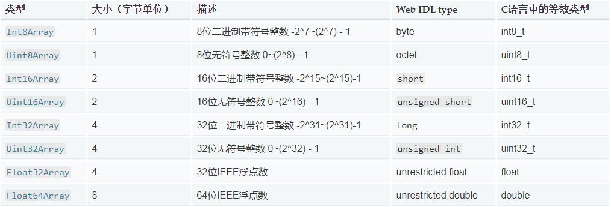

### TypedArray介绍

> TypedArray 用来描述一个二进制数据缓冲区

### 语法
```
new TypedArray()
new TypedArray(length)
new TypedArray(typedArray)
new TypedArray({ length })
new TypedArray(buffer[, byteOffset [, length]])
```

### 注意事项
```
a.在TypedArray原型上设置索引属性，实例对象是获取不到，设置字符属性可以获取到
示例：
Int8Array.prototype[0] = 1;
Int8Array.prototype.abc = 123;
var intArray = new Int8Array(10);

intArray[0]
// 0
intArray.abc
// 123

b.给TypedArray实例赋值时，如果类型不匹配，会先进行类型转换，然后在赋值，如果值类型依然不满足，则赋值不能成功，赋值位置会被赋值为该类型的默认值
var intArray = new Int8Array(1);

intArray[0] = true;
// [1]
intArray[0] = 'abc';
// [0]
```