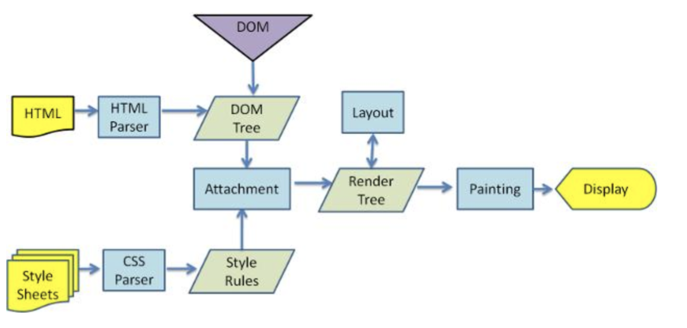

### 浏览器渲染流程（firefox）

### Render树生成规则
> 1.html下载之后，浏览器将html解析成 DOM 结构，把资源按优先级排序进行下载
>
> 2.解析到 head 节点：
>> 2.1 遇到 JS，暂停DOM解析，等待JS下载和执行
>> 2.2 遇到 CSS，接续DOM解析，等待CSS下载完构建CSSDOM
>
> 3.解析到 body：
>> 3.1 只有DOM节点时，DOM树构建完结合CSSDOM渲染首屏
>> 3.2 有DOM和JS，JS标签后面的DOM停止解析（阻止解析），前面的DOM渲染到页面上
>> 3.3 有DOM和CSS，等待CSS下载和解析完成（阻止渲染）和DOM结合渲染首屏
>> 3.4 有DOM，JS和CSS
>>> 3.4.1 CSS在JS之前：CSS下载并解析完成后才会渲染页面，渲染JS之前的DOM
>>> 3.4.2 JS在CSS之前：JS阻止DOM解析，JS下载执行完成后，继续解析DOM，后面流程同（3.3）
>
> 4.文档解析完成后，页面重新渲染一次。同步JS执行完成之后出发 DOMContentLoad 事件

### JS/CSS解析原则：
* css不会阻止DOM的解析，但是会阻止页面的渲染(DOM+CSS -> Render Tree)
* js会阻止DOM的解析，需要等到js下载并执行后才开始往后解析(JS可能直接删除DOM，导致无用解析)
* 遇到DOM标签，执行DOM构建，将DOM添加到文档树中
* 加载和解析CSS过程，不同浏览队与JS处理不同，Firefox户禁用JS执行，webkit只有当JS访问元素样式时才会禁用JS。

### JS/CSS在页面中放置位置最佳实践
* 如果js必须放在header中，且js不依赖CSS，应该将JS放在样式表之前。（css在前会阻止js执行，js在前可以并行，参考解析原则4）
* 有限加载关键css，懒加载非关键css
* 浏览器对于页面展示做了分步展示优化，可以将CSS分成多块放在页面上不同位置，让页面逐步加载（如果浏览器不支持分步加载页面会按照原有方式：完全加载CSS再展示）

### 参考wiki
* 浏览器渲染：http://www.cnblogs.com/coco1s/p/5439619.html
* css位置和首屏加载时间：https://mp.weixin.qq.com/s/OigM7dPFS3OGEBUE6KjHQA
* 浏览器渲染过程：https://www.infoq.cn/article/CS9-WZQlNR5h05HHDo1b
* CSS/JS位置和渲染时机：https://juejin.im/post/5b2a508ae51d4558de5bd5d1