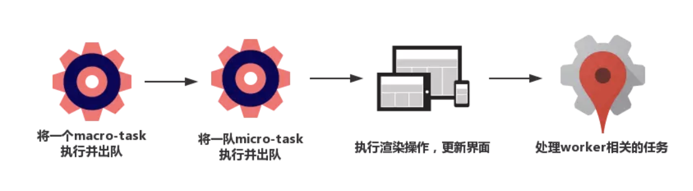

### 浏览器一次事件循环

### 一个完整的事件循环
* 1.开始状态：调用栈为空，micro队列为空，macro队列中执行script脚本
* 2.全局上下文代码（script）被推入调用栈，代码同步执行，执行过程中产生新的macro和micro任务放入对应的队列中。script代码从macro队列中移除
* 3.执行整个micro队列
* 4.执行渲染操作，更新界面
* 5.检查是否有webwork任务，有则对其进行处理
* 6.重复进行操作一

### 备注
* macro任务：setTimeout，setInterval，setImmediate，script， I/O操作，UI渲染
* micro任务：process.nextTick，Promise，MutationObserver
* macro任务队列每次只执行一个
* micro任务队列每次执行整个队列
* 任务优先级：nextTick > Promise > setTimeout > setImmediate(setTimeout和setImmediate执行顺序参考nodeJS事件循环)

### 相关阅读
* 事件循环：https://www.jianshu.com/p/12b9f73c5a4f
* 浏览器渲染和事件循环：https://juejin.im/entry/59082301a22b9d0065f1a186
* requestIdleCallback: https://segmentfault.com/a/1190000014457824